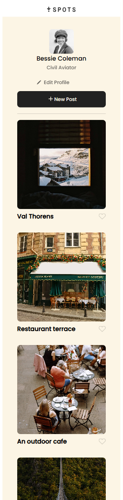

# Spots - Personal Image Sharing Platform

## Overview

Spots is a dynamic web application that allows users to create a personalized image sharing experience. Users can upload their favorite photos, organize them in a visually appealing gallery, and interact with content through a like system. The platform provides an intuitive interface for managing personal photo collections with full CRUD (Create, Read, Update, Delete) functionality.

### Project Goals

- Create a responsive, user-friendly photo sharing platform
- Implement modern web development practices with vanilla JavaScript
- Provide seamless user experience across all devices
- Enable real-time interaction with photos through API integration

## Features & Implementation

### Core Functionality

- **Photo Upload & Management**: Users can add new photos with custom titles and descriptions
- **Interactive Gallery**: Clean, responsive grid layout displaying all uploaded photos
- **Like System**: Users can like/unlike photos with real-time updates
- **Profile Management**: Editable user profile with avatar and bio customization
- **Delete Functionality**: Secure photo deletion with confirmation modal

### Technical Implementation

- **Frontend**: Vanilla JavaScript (ES6+), HTML5, CSS3
- **API Integration**: RESTful API for data persistence and real-time updates
- **Responsive Design**: Mobile-first approach with CSS Grid and Flexbox
- **Form Validation**: Client-side validation with real-time feedback
- **Modal System**: Custom modal components for user interactions
- **Webpack**: Module bundling and build optimization

### Architecture

- Modular JavaScript architecture with separate API and validation utilities
- Object-oriented programming principles for maintainable code
- Event-driven user interface with proper error handling
- Optimized asset loading and caching strategies

## Screenshots & Demo

### Desktop Version

### Mobile Version

### Interactive Features

- [Edit Button Demo](src/images/screenshots/Edit%20Button.mp4)
- [Like Button Demo](src/images/screenshots/Like%20Button.mp4)
- [Post Button Demo](src/images/screenshots/Post%20Button.mp4)

## Live Demo

🌐 **[View Live Project](https://marquezgg.github.io/se_project_spots)**

## Video Preview

🎥 **[Watch Project Demo](https://1drv.ms/v/c/b8d273e74844f620/ERbxWB0wEztMgz1Go7_7BNsB2DBpn1Ao7OkBh9AcArFEUw)**

## Technology Stack

- **Frontend**: HTML5, CSS3, JavaScript (ES6+)
- **Build Tools**: Webpack, Babel
- **Styling**: CSS Grid, Flexbox, CSS Custom Properties
- **API**: RESTful API integration
- **Version Control**: Git, GitHub
- **Deployment**: GitHub Pages

## Results & Achievements

The Spots platform successfully delivers a modern, responsive photo sharing experience that meets all project requirements:

- ✅ **Fully Responsive**: Seamless experience across desktop, tablet, and mobile devices
- ✅ **Performance Optimized**: Fast loading times with optimized assets and efficient code
- ✅ **User-Friendly**: Intuitive interface with smooth animations and transitions
- ✅ **Robust Functionality**: Complete CRUD operations with proper error handling
- ✅ **Modern Standards**: Clean, maintainable code following best practices

## Future Improvements & Business Opportunities

### Technical Enhancements

- **User Authentication**: Implement user accounts and secure login system
- **Social Features**: Add commenting, sharing, and following functionality
- **Advanced Search**: Filter and search capabilities by tags, dates, or users
- **Offline Support**: Progressive Web App features for offline functionality
- **Image Processing**: Automatic image optimization and multiple format support

### Business Opportunities

- **Premium Features**: Offer enhanced storage and advanced editing tools
- **Social Integration**: Connect with popular social media platforms
- **Analytics Dashboard**: Provide users with engagement insights and statistics
- **Mobile App**: Develop native iOS and Android applications
- **API Monetization**: Offer API access for third-party developers

### Scalability Considerations

- **Database Migration**: Transition to more robust database solutions
- **CDN Integration**: Implement content delivery network for global performance
- **Microservices Architecture**: Break down into scalable, independent services
- **Real-time Features**: Add live notifications and real-time collaboration
